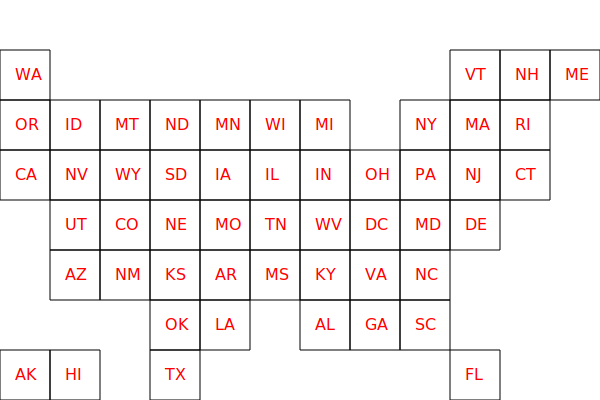

# Dan's own U.S. state cartogram maker

I've been playing around with D3 to make my electoral maps, but I couldn't find an abstract but not too abstract representation of U.S. states (check out the [possibilities in this cool D3 block by Noah Veltman](http://bl.ocks.org/veltman/c7bfb3d4a3817f7ee0bf2dd19ff058c1))

Ultimately, I wrote a little Python to generate my own blocky cartogram, which looks like this: 

## Prior work

Someone on the newsnerdery slack pointed me to this excellent exploded state elections map, generously shared via Creative Commons by Daniel Donner at Daily Kos:

https://docs.google.com/spreadsheets/d/1LrBXlqrtSZwyYOkpEEXFwQggvtR0bHHTxs9kq4kjOjw/edit#gid=134715392

However, I needed something a little more normalized and not necessarily scaled by population. Something like the wonderful, elegant, and sensible cartograms used by The Marshall Project – such as in this state-by-state comparison of prison readiness for covid-19:

https://www.themarshallproject.org/2020/03/17/tracking-prisons-response-to-coronavirus

I liked Marshall Project's version so much that I decided to heavily imitate it. I created a spreadsheet containing an approximate row-col arrangement of states as MP has them, then I moved things around to my own liking (I'll be damned if I make a cartogram that puts Indiana directly west of Iowa). 

## Quickie scripting

Finally, using the [excellent svgwrite Python library](https://svgwrite.readthedocs.io/en/latest/), I wrote a quickie script [scripts/svgdrawer.py](scripts/svgdrawer.py) to read my [spreadsheet](data/stategrid.csv) and generate the [SVG](svg/stategrid.svg):

## TODO

- Use svgwrite to add data attributes to each shape, e.g. state names/abbreviations
- Figure out a way to gracefully covert SVG into topojson for better integration with D3.geo mapping
